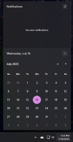
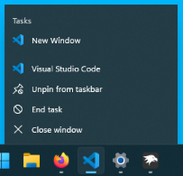

# The Windows 11 notification center styling guide

*This document is a work in progress, contributions are welcome.* \
***See also**: [The Windows 11 taskbar styling
guide](https://github.com/ramensoftware/windows-11-taskbar-styling-guide/blob/main/README.md),
[The Windows 11 start menu styling
guide](https://github.com/ramensoftware/windows-11-start-menu-styling-guide/blob/main/README.md).*

## Table of contents

* [Introduction](#introduction)
* [Themes](#themes)
* [Style examples](#style-examples)
* [Transforms](#transforms)
  * [Translate](#translate)
  * [Rotate](#rotate)
  * [Scale](#scale)
  * [Skew](#skew)
  * [Other Properties](#other-properties)
* [Work in progress](#work-in-progress)

## Introduction

This is a collection of commonly requested notification center styling
customizations for Windows 11. It is intended to be used with the [Windows 11
Notification Center
Styler](https://windhawk.net/mods/windows-11-notification-center-styler)
Windhawk mod.

If you're not familiar with Windhawk, here are the steps for installing the mod:

* Download Windhawk from [windhawk.net](https://windhawk.net/) and install it.
* Go to "Mods" in the upper right menu.
* Find and install the "Windows 11 Notification Center Styler" mod.

After installing the mod, open its Settings tab and adjust the styles according
to your preferences.

Some customizations are best to be adjusted with other Windhawk mods. Links to
those mods are provided where applicable.

### Missing customizations

If you're looking for a customization that is not listed here, please [open an
issue](https://github.com/ramensoftware/windows-11-notification-center-styling-guide/issues/new).

### Contributing

If you have a notification center styling customization or theme that you would
like to share, please submit a pull request.

## Themes

Themes are collections of styles that can be imported into the Windows 11
Notification Center Styler mod. The following themes are available:

| Link | Screenshot
| ---- | ----------
| [TranslucentShell](Themes/TranslucentShell/README.md) | 
| [Unified](Themes/Unified/README.md) | 
| [10JumpLists](Themes/10JumpLists/README.md) | 

## Style examples

### Hide the focus assist section
**Target**: `ActionCenter.FocusSessionControl` \
**Style**: `Height=0`

### Hide the notification center
**Target**: `Grid#NotificationCenterGrid` \
**Style**: `Visibility=Collapsed`

### Shrink the notification center height
Makes panel non full-height when there are fewer notifications (fit to size). \
**Target**: `Grid#NotificationCenterGrid` \
**Style**: `VerticalAlignment=2`

### Square the corners of the notification center
**Target**: `Grid#NotificationCenterGrid` \
**Style**: `CornerRadius=0`

### Square the corners of the calendar
**Target**: `Grid#CalendarCenterGrid` \
**Style**: `CornerRadius=0`

### Square the corners of the quick action center
**Target**: `Grid#ControlCenterRegion` \
**Style**: `CornerRadius=0`

### Calendar and notification titlebars: titles on the right, buttons on the left
**Target**: `Grid#RootContent` \
**Style**: `FlowDirection=1`

### Add accelerator key (Alt+X) to clear all notifications
**Target**: `Button#ClearAll` \
**Style**: `AccessKey=x`

### Add accelerator key (Alt+E) to expand/collapse the calendar
**Target**: `Button#ExpandCollapseButton` \
**Style**: `AccessKey=e`

## Transforms

You can use transformation styles to translate, rotate, scale, or skew elements.

> **Should I use `RenderTransform` or `Transform3D`?**
>
> For 2D transformations, it is best to stick to `RenderTransform` in most cases. Using `Transform3D` for 2D transformations can cause elements to become blurry. For 3D transformations, you must use `Transform3D`.

> [!TIP]
> You can mix and match transformations when using `Transform3D`! You can also use `RenderTransform` and `Transform3D` together.
>
> For example: `Transform3D:=<CompositeTransform3D TranslateY="-15" RotationZ="15" ScaleX="1.5" />`

### Translate

  `RenderTransform:=<TranslateTransform Y="-15" X="15" />`

  -- or --

  `Transform3D:=<CompositeTransform3D TranslateY="-15" TranslateX="15" TranslateZ="-15" />`

### Rotate

  `RenderTransform:=<RotateTransform Angle="15" />`

  -- or --

  `Transform3D:=<CompositeTransform3D RotationX="-15" RotationY="15" RotationZ="-15" />`

  > X: 3D vertical rotation.
  >
  > Y: 3D horizontal rotation.
  >
  > Z: 2D rotation.

### Scale

  `RenderTransform:=<ScaleTransform ScaleX="1.5" ScaleY="-1.5" />`

  -- or --

  `Transform3D:=<CompositeTransform3D ScaleX="-1.5" ScaleY="1.5" ScaleZ="-1.5" />`

### Skew

  `RenderTransform:=<SkewTransform AngleX="-15" AngleY="15" />`

### Other Properties
- Rotate, Scale and Skew:
  - `CenterX`: Offsets the transform's origin on the X axis.
  - `CenterY`: Offsets the transform's origin on the Y axis.
  - `CenterZ`: Offsets the transform's origin on the Z axis. (Only for `Transform3D`)

## Work in progress

*This document is a work in progress, contributions are welcome.* \
***See also**: [The Windows 11 taskbar styling
guide](https://github.com/ramensoftware/windows-11-taskbar-styling-guide/blob/main/README.md),
[The Windows 11 start menu styling
guide](https://github.com/ramensoftware/windows-11-start-menu-styling-guide/blob/main/README.md).*
